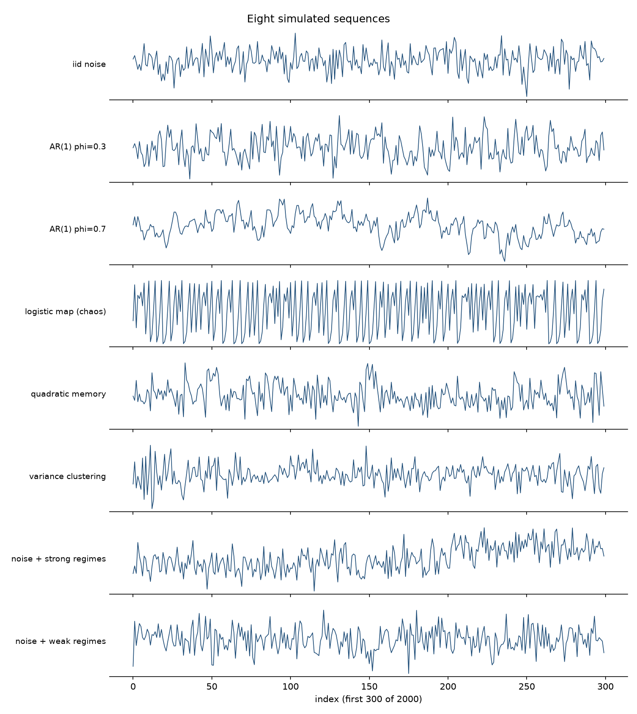
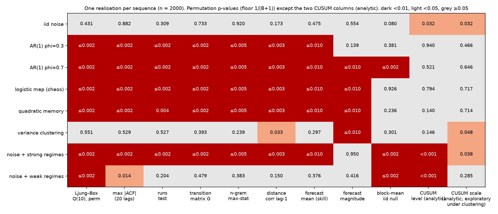
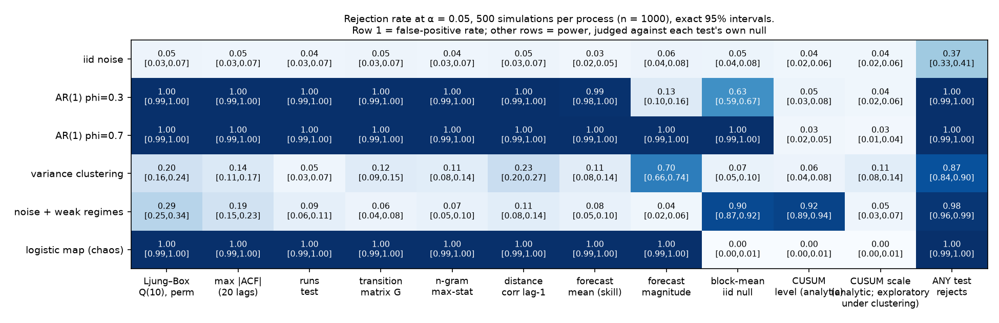

# Is There Predictable Structure? A Workflow for Testing Numerical Sequences

*You have a list of numbers in time order and a decision that depends on what comes next. This is a workflow for finding out whether the sequence contains structure you can use: name the decision, choose a diagnostic that targets the structure that would help, challenge every finding with a null model that actually encodes "no structure", and check — on data you have not touched — whether exploiting the finding improves the decision. Every number here comes from simulated data and runnable code.*

---

The load factor of a server. Daily temperatures. Defect counts per batch. Web traffic per minute. And the most scrutinised sequence of all: a price chart, for which a whole vocabulary of named shapes exists — formations that are said to recur, streaks that are supposedly due to end — every one of them a claim that the past of the sequence tells you something about its next values. Every one of these arrives as a list of numbers in order, and sooner or later someone looks at the plot and asks: *is there a pattern in this, or is it just noise?*

The eye is a pattern generator. It finds runs in coin flips and cycles in random walks. In a long stretch of work on noisy sequences, almost every "pattern" I found — repeating shapes, lucky states that seemed to predict the next one, machine-learned scores with encouraging accuracy — went away as soon as I built a null hypothesis that actually encoded what "no pattern" meant. What survived was a way of working.

It starts from the decision, not from the data. "Is this random?" is not one question. A sequence can have no serial correlation and still have predictable variance; it can have no memory of any kind and still change its distribution halfway through; it can be predictable in principle and useless in practice because the predictable part is too small to change what you would do. No battery of tests certifies randomness. A battery tells you which kinds of structure you looked for, how hard, and whether you found them — and the only reason to look is that finding one would change an action.

The recurring example is a server's load factor: one value per 15-minute interval, and an operations team that must decide, at the end of each interval, whether to bring extra capacity online for the next one.

---

## Use this workflow on your data

1. **Define the target, the horizon, and the decision.** One sentence: "At time *t*, using what is known at *t*, we predict [the next value / whether the next value exceeds a limit / whether the level has shifted] over the next [horizon], and if the prediction says X we will do Y." If you cannot write it, you are not ready to test anything.
2. **Check the data before the statistics.** Timestamps monotone and evenly spaced? Missing values and how they were filled? Sampling-interval changes, recalibrations, firmware updates, unit changes? Are any values *windows* over other values (rolling means, per-shift totals), so that consecutive entries overlap? Each of these creates structure a test will find, and it is not the structure you want.
3. **Reserve an untouched future period now.** The last 20–30% of the data, or the next month of it. Nothing below runs on it until the end, once, with everything pre-specified.
4. **Establish the simple baselines.** The mean. The last value (persistence). The same time yesterday (seasonal persistence). The rule the team already uses. Anything you propose has to beat these, on future data, by a margin that matters.
5. **Choose a small set of diagnostics for the question.** Two or three; the four paths below say which. Running every diagnostic on every series is exploration, and exploration produces candidates, not findings.
6. **Challenge each finding with a defensible null.** A null must remove exactly the structure you are testing for and keep everything else. "Shuffle and see" is the right instinct and an insufficient justification.
7. **Evaluate the practical improvement on the reserved period.** Not the p-value: the loss the decision actually incurs, against the baseline, with an uncertainty interval, and with inputs restricted to what is available at decision time.

---

## A walk through the workflow: one series, one decision, one future

Before the catalogue of diagnostics, here is the whole workflow on one series. The data are a **simulated** load factor of a server — the load average divided by the number of cores, averaged over each 15-minute interval, so that 1.0 means fully loaded and higher values mean queued work — for 180 days, generated by a known process (a daily cycle, an autoregressive component with coefficient 0.35 per interval, Gaussian noise); the analysis does not use that knowledge. Code: `worked_example.py`.

**Step 1 — the decision.** At the end of each 15-minute interval, the operations team decides whether to bring extra capacity online for the *next* interval. Extra capacity costs 1 unit per interval. An overload — a load factor above 0.86 — during an interval without extra capacity costs 20 units (degraded service). Under these costs, adding capacity pays exactly when the probability of an overload in the next interval exceeds 1/20 = 5%. The costs are illustrative; the arithmetic is not — but it rests on simplifying assumptions that a real deployment would have to check: extra capacity, once added, prevents the *whole* overload penalty for that interval; it is available in time for the next interval; there is no start-up or switching cost, so each interval's decision stands alone; and the capacity cost is incurred whether or not the overload materialises. Relax any of these (a warm-up lag, a minimum billing period, partial relief) and the break-even probability moves, and the policies have to be re-costed. The **existing policy (B)** is the team's rule: add capacity if the current load factor is above 0.80. The **proposed policy (C)** replaces the fixed threshold with a forecast: add capacity if the predicted probability of an overload in the next interval exceeds 5%. Two references: never adding capacity (A), and the existing rule with its threshold re-tuned on recent data (B′), included so that any gain from C can be separated from the gain of merely re-tuning a threshold.

**Step 2 — the data, and the reserved future.** 17,280 fifteen-minute values, no gaps. The last 54 days (30%) are set aside before anything else is done. The overload rate is 1.6% in the development period and 1.4% in the reserved period.

**Step 3 — known structure and baselines.** The clock is known, so a daily cycle needs no test. Time-of-day means — one per 15-minute slot, 96 of them — are estimated *inside each training window* of a rolling-origin evaluation, never from the fold being predicted; they range from about 0.52 (around 04:00) to 0.70 (around 14:45). Against the time-of-day-mean baseline, persistence (the last value) scores −0.30 and seasonal persistence (the same slot yesterday) −1.00: with a mild autoregression and a residual spread of 0.10, copying yesterday is a bad forecast. A linear model on the last three deseasonalised values, coefficients re-fitted at each origin, has skill +0.121, per fold +0.09, +0.13, +0.12, +0.14, +0.12 — positive in every fold, which is the stability check.

**Step 4 — two diagnostics for the question, with their nulls.** The question is Path 1: is the conditional mean predictable one interval ahead? Ljung–Box Q(10) on the deseasonalised values is 1,669, permutation p ≤ 0.002 (B = 500): the sequence is not exchangeable, and the statistic that saw it is low-order autocorrelation. The kNN forecast test — time-of-day means re-learned at every origin, inside every null pipeline too — gives skill +0.086, p ≤ 0.005 (B = 200). The null matters here. Permuting the whole sequence tests "is the series iid?", and since the permutation destroys the daily cycle as well as the serial dependence, a rejection could come from the cycle alone: the null pipelines re-estimate time-of-day means from a sequence that no longer has any. The question is narrower — is there predictability *beyond* the clock? — so the null permutes values only among positions that share a 15-minute slot of the day. Every slot mean survives exactly; only the order within each slot is randomised; the null is "exchangeable given the clock". Against that null the skill is also +0.086, p ≤ 0.005. On this series both nulls give the same verdict, but only the second answers the question asked. As a guard, the CUSUM level test on the same residuals gives T = 0.97, p = 0.30: no level shift detected. Not "the level is stable" — a test that did not reject, at this sample size, against shifts of the kind it can see. Reading the rejections above as *stationary* dependence needs an assumption the tests do not supply: that neither the server's hardware nor its workload mix changed over the period. That is a question for the change log, not for a statistic.

**Step 5 — from forecast to probability to decision.** The one-interval-ahead forecast is the slot mean plus the linear model's prediction; its residual spread on the development period is 0.098. The predicted overload probability is the Gaussian tail above 0.86 given that forecast and spread. Is it reliable? The check uses out-of-fold predictions: for each rolling-origin fold, slot means, coefficients and residual spread are learned on the training window and the probabilities are predicted for the fold, so 7,256 development intervals receive a probability from a model that never saw them. Intervals with predicted probability in [2%, 5%) had an observed overload rate of 3.0% (1,146 intervals) against a mean prediction of 3.2%; in [5%, 10%), 6.1% (510) against 6.9%; in [10%, 20%), 14.5% (138) against 12.8%. How uncertain are those rates? A binomial interval assumes independent intervals with a common probability inside the bin, and neither holds here: consecutive intervals share information and overloads cluster, and the predictions inside a bin differ. Unequal probabilities make the binomial *conservative* (the variance of a sum of Bernoullis with unequal p is below the binomial's), but dependence makes it too narrow. So the interval used is **day-clustered**: for each bin, the daily sums of (outcome − predicted probability) over the bin's intervals, and the variance of those daily sums across the period's days — the same approximation the cost interval uses, days treated as independent because the series' memory is under an hour. Observed minus predicted, with that interval: [2%, 5%) −0.2 points [−1.1, +0.7]; [5%, 10%) −0.8 [−2.8, +1.2]; [10%, 20%) +1.7 [−4.8, +8.2]. Every bin with a usable count covers zero; the bin above 20% holds seven intervals on a handful of days and no interval built on it means anything. Supporting evidence from one series, not a general property of the model. Policy C adds capacity when this probability exceeds 5%; no threshold is searched. Development costs per interval: A 0.319, B 0.266, B′ 0.263 (threshold 0.780), C 0.265 — on the data used for fitting, the forecast policy is level with the re-tuned rule.

**Step 6 — confirmation on the reserved 54 days, nothing re-tuned.** Slot means, coefficients, residual spread and thresholds are all fixed from the development period.

| policy | cost / interval | scale-ups / day | overloads covered |
|---|---|---|---|
| A never add capacity | 0.286 | 0.00 | 0 / 74 |
| B existing rule (> 0.80) | 0.254 | 4.72 | 21 / 74 |
| B′ re-tuned rule (> 0.78) | 0.224 | 6.69 | 34 / 74 |
| C forecast probability > 5% | 0.239 | 8.15 | 34 / 74 |

C minus B: −0.015 per interval, a 5.7% saving. The uncertainty interval is computed from **paired daily costs**: for each of the 54 days, the cost per interval under C minus the cost per interval under B, then the mean of those 54 differences with a t-interval (standard deviation of the daily differences 0.117, divided by √54). Days are treated as independent; the series' memory is under an hour (coefficient 0.35 per 15 minutes, negligible after a few hours), and the lag-one autocorrelation of the daily differences is +0.12. A Newey–West interval with two lags, which adjusts for serial dependence in the daily differences, differs by less than 0.001. The interval is **[−0.046, +0.017]**. The forecast's skill on the reserved period, frozen at the split, was +0.128; among the 440 intervals flagged above 5% (8.5% of intervals) the observed overload rate was 7.7% against a mean prediction of 8.3%; observed minus predicted −0.6 points, day-clustered interval [−2.9, +1.7] — consistent with the predictions on this stretch. Then the result that was not in the plan: B′, the existing rule with its threshold lowered to 0.78 on the development data, did *better* than the forecaster — the same 34 overloads covered with fewer scale-ups. The change that is actually being proposed is B → B′, so that difference gets its own paired interval: **B′ minus B: −0.030 per interval, an 11.7% saving, interval [−0.055, −0.004]** (lag-one autocorrelation of the daily differences +0.07; Newey–West [−0.054, −0.005]). That interval excludes zero. C minus B′: +0.015 per interval, the forecaster 6.8% dearer than the re-tuned rule, interval [−0.014, +0.044], which includes zero — and an interval that includes zero says the data cannot rank the two, not that they are equivalent.

**Step 7 — what the evidence supports.** The series has predictable structure beyond the clock at a 15-minute horizon: detected on the development period, confirmed on the reserved period, stable across folds, and turned into probabilities whose observed rates agree with the predictions in every bin the data can check. Exploiting it through a probability-driven capacity policy produced a saving over the existing rule whose interval includes zero. A one-number change to the existing rule, evaluated on the same reserved period, produced a saving whose interval excludes zero — that is the evidence for the change actually proposed. The forecaster against the re-tuned rule is undecided, not equivalent. Choosing B′ is therefore partly evidence (its own interval) and partly a practical judgment: it needs no model, no probability, no recalibration, and it can be reversed in a minute. The action is to lower the threshold to 0.78, keep the forecaster as a candidate, and re-run the confirmation after a further 90 days with both. The output is not "the server is predictable". It is: "the predictable part beyond the clock is real but not yet shown to be worth paying for; moving the threshold is."
Everything after this point is what went into those seven steps: the four kinds of question, what a null model has to encode, the diagnostics and their failure modes, and the ways a finding gets manufactured.

---

## Four paths, one method

Each path answers the same six questions: what outcome are we improving, what is known at decision time, what structure would help, which diagnostic and null address it, does exploiting it improve future results, and what remains uncertain.

**Path 1 — predicting the next value.** *Outcome:* a smaller forecast error, or a better-timed action, at horizon *h*. *Known at decision time:* the past of the series and the clock. *Structure:* a conditional mean E[xₜ₊ₕ | past] that differs from the unconditional mean — serial correlation is the linear case, not the only one. *Diagnostics:* Ljung–Box or max |ACF| against an exchangeability null for the linear part; rolling-origin forecast skill against an iid-sequence null pipeline for the general part. *Future evaluation:* the forecast's loss against the baselines on the reserved period. *Uncertainty:* the skill's variation across folds and eras, and the fact that a detectable improvement may be too small to change the decision — as in the walkthrough.

**Path 2 — anticipating magnitudes, uncertainty, or extreme events.** *Outcome:* fewer missed exceedances, fewer false alarms, or a tighter prediction interval. *Structure:* a conditional variance or conditional distribution that moves — quiet stretches and turbulent stretches — even when the conditional mean does not. *Diagnostics:* forecast skill on the magnitude target |xₜ − c|, transition-matrix dependence between coarse states, distance correlation at lag one. *Future evaluation:* the exceedance decision's cost, or the interval's coverage, on the reserved period. *Uncertainty:* predictable variance makes the *distribution* of the next value predictable, not the value; it is useful only if the decision uses the distribution, and it does not guarantee that a finite-sample model will show positive skill.

**Path 3 — detecting changes in operating conditions.** *Outcome:* recalibrate, investigate, or retrain when the process has changed. *Structure:* a level or scale that differs between stretches, beyond what the ordinary dependence produces. *Diagnostics:* a block-mean test against an exchangeability null says the series is not iid; a CUSUM test with a long-run-variance correction asks whether the level (or scale) changed beyond what a stationary, weakly dependent process produces. *Future evaluation:* does acting on a detected change reduce the cost of running a stale model or a mis-set limit? *Uncertainty:* "is there dependence" and "did the level change" are separable only under stated assumptions.

**Path 4 — evaluating external predictors.** *Outcome:* a better forecast, or a cause worth acting on. *Structure:* association between a candidate and the outcome after controlling for what you already know. *Diagnostics:* partial correlation with a nuisance-preserving permutation (Freedman–Lane); a circular-shift null for periodic covariates; a max-statistic null when many candidates are screened. *Future evaluation:* the covariate-augmented forecast against the forecast without it. *Uncertainty:* a periodic covariate correlates with any periodic outcome; a candidate collinear with a control cannot be evaluated; screening many candidates makes the best one look good by construction.

---

## What a null model is for

Every diagnostic reports a p-value, and it matters which kind.

**Permutation p-values.** A permutation test is valid when the null implies an *invariance*: some transformation leaves the joint distribution of the data unchanged. For a reordering, the invariance is **exchangeability** — under the null, every ordering is equally likely. The iid null implies exchangeability; the converse fails (draw a coin's bias at random, then flip it forever — the flips are exchangeable and dependent). So a test that shuffles the sequence tests exchangeability. Rejecting it is evidence against iid. Not rejecting it is not evidence for independence.

This has a consequence that is easy to miss. A permutation Ljung–Box test is **not** a test of "zero autocorrelation" that tolerates other departures from iid. A series with no autocorrelation but with variance clustering is not exchangeable, and the permutation test rejects it some of the time (20% at n = 1,000 for the clustering process used below) — correctly, as a test of exchangeability, and misleadingly if you read the rejection as autocorrelation. If your null is "uncorrelated, possibly heteroskedastic", you need a reference that encodes it, such as a heteroskedasticity-robust standard error for the autocorrelations, not a shuffle.

The recipe for every test marked *null = iid*: compute the statistic *T*; permute the **original sequence** and recompute *T*, rebuilding from the permuted sequence anything derived from it — lagged pairs, coarse states, delay embeddings, training folds, calendar adjustments; repeat *B* times; report

> **p = ( #{ T_null ≥ T_real } + 1 ) / ( B + 1 )**

The +1 counts the observed sequence as one more draw from the null (Phipson & Smyth, 2010). The smallest reportable p is 1/(B+1): 0.002 at B = 500, 0.0099 at B = 100. A printed "p = 0.000" from 500 permutations is a bug.

```python
def perm_p(real, null):
    """Monte-Carlo p-value with +1 correction (Phipson & Smyth 2010). Floor = 1/(B+1)."""
    null = np.asarray(null, float)
    if not np.isfinite(real) or not np.all(np.isfinite(null)):
        raise ValueError("non-finite statistic: diagnose it, do not drop it")
    return (np.sum(null >= real) + 1) / (len(null) + 1)
```

Non-finite null draws are an error, not something to filter out: they mean the statistic is undefined for some permutations, and the fix is in the statistic.

**Analytic p-values.** The two CUSUM tests use a limiting distribution instead of resampling. Analytic p-values rest on asymptotic approximations whose accuracy for a given process is an empirical question; Appendix E answers it by simulation for the processes used here.

**What rejection and non-rejection mean.** Rejecting an exchangeability null says the sequence is not iid, not *how*: a serial-correlation statistic points at low-order linear memory, but a block-mean statistic could be pointing at a changing level *or* at ordinary dependence. Every rejection statement below is tied to its null and its statistic. Non-rejection means the statistic did not move far enough, for this statistic, at this n, against this many permutations; it never means the null is true. Where the intended conclusion is "any effect is too small to matter", the tool is an equivalence test against pre-specified bounds, not a large p-value.

**"Destroying the structure" is intuition, not justification.** A shuffle destroys serial dependence — and also a legitimate seasonal cycle, a legitimate relation between an outcome and a control, and the overlap structure of windowed statistics. If the null should keep any of those, the shuffle is the wrong transformation: a *circular shift* for periodic covariates, *residual permutation* for association after controlling, and *sequence-level rebuilding* for anything computed from windows. Always ask: what does the null say is exchangeable, and does my transformation respect it?

---

## The diagnostics

Each diagnostic is described the same way: when to use it, what it needs, a starting configuration, the null and its assumption, what rejection and non-rejection mean, the next practical action, and the failure mode most likely to mislead. Formula first, then code from `randomness_toolkit.py`. Derivations and the simulation evidence for the analytic approximations are in the appendices.

### Serial correlation: Ljung–Box, max |ACF|, runs

*Path 1. Use when the decision depends on the next value and the past is the only input.*

**Needs:** a constant sampling interval, no missing values, and known cycles removed first (subtract the hour-of-day or day-of-week mean, estimated on the training data), because a cycle *is* autocorrelation and will dominate the statistic.

The autocorrelation at lag *k* is the correlation of the series with itself shifted by *k*:

> **ρ(k) = Σₜ (xₜ − x̄)(xₜ₊ₖ − x̄) / Σₜ (xₜ − x̄)²**

The **Ljung–Box statistic** (Ljung & Box, 1978) collects the first *h* lags:

> **Q = n(n+2) Σₖ₌₁ʰ ρ(k)² / (n − k)**

Squaring makes positive and negative correlations both count; dividing by (n − k) corrects for long lags being estimated from fewer pairs. The textbook reference is χ² with *h* degrees of freedom, minus the number of parameters when Q is computed on the residuals of a fitted model — asymptotic, and derived for white noise with constant variance. Under variance clustering the χ² approximation is distorted, which is exactly when you would most like to trust it. The workflow uses Q as a statistic with a permutation reference and keeps the analytic version as a separate, labelled function.

```python
def ljung_box_stat(x, max_lag=10):
    n = len(x)
    return n * (n + 2) * sum(autocorr(x, k)**2 / (n - k) for k in range(1, max_lag + 1))

def ljung_box_test(x, max_lag=10, B=500):
    """Null: exchangeable (iid). Statistic: Q. Resampling: permute the sequence."""
    real = ljung_box_stat(x, max_lag)
    null = [ljung_box_stat(RNG.permutation(x), max_lag) for _ in range(B)]
    return real, perm_p(real, null), B, "perm"
```

**Starting configuration:** h = 10 for hourly data, B = 500. Companions: **max |ρ(k)| over k = 1…20**, whose permutation replicates repeat the same twenty-lag search so that reporting the largest is not a hidden multiple comparison; and the **runs test** (Wald & Wolfowitz, 1940): cut at the median, count runs of consecutive above/below values, compare with the count expected under independence,

> **E[runs] = 1 + 2n₁n₂/(n₁+n₂),  z = (runs − E[runs]) / √Var[runs]**

with |z| so that clustering and alternation both count.

**Null:** exchangeability. **Rejection:** evidence against it, visible in low-order linear correlation of levels (or run structure). Under the additional assumption of stationarity, that is evidence of serial dependence in the mean; without it, a level shift produces the same rejection (the "weak regimes" row below rejects Ljung–Box at its floor with no dependence inside any regime), and so, sometimes, does variance clustering with no autocorrelation at all. **Non-rejection:** no detectable linear autocorrelation at these lags; nonlinear and variance dependence untested.

**Next action:** a rejection is a reason to build a forecast and measure it, not a result. If not rejected and the decision is about the next value, try the magnitude path before concluding the past carries nothing.

**Failure mode:** an unremoved cycle or drift, which produces an enormous Q with nothing exploitable at a one-step horizon.

### Coarse-state dependence: transition matrix and n-grams

*Paths 1 and 2. Use when dependence might be nonlinear or in the extremes — "big moves follow big moves, of either sign".*

Quantise the series into *k* equal-frequency states (terciles: low / mid / high) and count how often each state follows each other. With observed counts *Oᵢⱼ* and the counts expected under independence,

> **Eᵢⱼ = (row total ᵢ × column total ⱼ) / n,  G = 2 Σᵢⱼ Oᵢⱼ · ln(Oᵢⱼ / Eᵢⱼ)**

Then mine longer contexts: for every context of one, two or three preceding states, what follows? If a context occurred *m* times, was followed by state *s* on *c* of them, and *s* has base rate *p*, the surprise of that cell is

> **z = (c − m·p) / √(m·p·(1−p))**

Rank cells by *z*, not by hit rate: at the same proportion, ten times the support gives √10 ≈ 3.2 times the z-score, so "18 of 20" and "180 of 200" are both 90% but the second is far less likely to be luck. Require a minimum support. The *z* is a **ranking heuristic**, not a reference distribution — occurrences of a length-three context overlap, so the trials are not independent binomial draws. The reference comes from the permutation.

With three states and contexts up to length three there are 3 + 9 + 27 = 39 contexts and three successors each — over a hundred cells — and the largest z among a hundred noise cells is always impressive. The correction is the **max-statistic null** (Westfall & Young, 1993): permute the sequence *once*, repeat the *entire* search on that one permuted sequence, keep the single best z, and do that B times. Every "three rises are followed by a fall" rule ever drawn on a chart is a cell in this table, and the question is always: is it better than the best cell you would find in noise?

```python
def ngram_test(x, k=3, max_order=3, B=200):
    """Null: iid symbols. Statistic: best |z| over all contexts of all orders.
    Resampling: ONE permuted sequence per replicate; the whole search repeated on it."""
    sym = discretize(x, k)
    real = ngram_search(sym, k, max_order)
    null = [ngram_search(RNG.permutation(sym), k, max_order) for _ in range(B)]
    return real, perm_p(real, null), B, "perm"
```

**Starting configuration:** k = 3, orders 1–3, minimum support 20, B = 200. **Null:** exchangeable symbols. **Rejection:** some (context → next state) cell is over- or under-populated beyond what searching a memoryless sequence produces. **Non-rejection:** nothing stands out at these orders and this support.

**Next action:** a rejection names a candidate rule. Convert it into a forecast or alarm and evaluate it on the reserved period against random selection at the same rate (see "rule versus random subsets" below).

**Failure mode:** believing the raw hit rate. A rule that "predicts a rare state 90% of the time" bundles support, base rate, selection, and sampling variability (at support 20, a 90% estimate has a standard error near 7 points). None makes the rule impossible; together they make a hit rate uninformative until the search that found it is inside the null.

### Dependence of any form at lag one: distance correlation

*Path 2. Use when dependence might run through the square or absolute value of the previous value.*

Pearson's correlation measures linear association, Spearman's measures monotone association. If xₜ depends on xₜ₋₁ through its square, both can be near zero when xₜ₋₁ is symmetrically distributed. **Distance correlation** (Székely, Rizzo & Bakirov, 2007) has no such blind spot: build pairwise distance matrices *aᵢⱼ = |xᵢ − xⱼ|* and *bᵢⱼ = |yᵢ − yⱼ|*, double-centre each (subtract row and column means, add the grand mean) to get *Aᵢⱼ*, *Bᵢⱼ*, and define

> **dCov²(X,Y) = (1/n²) Σᵢⱼ Aᵢⱼ Bᵢⱼ,  dCor(X,Y) = dCov(X,Y) / √(dVar(X)·dVar(Y))**

If points far apart in *x* are systematically far apart (or close) in *y*, the centred products line up. The theorem is about the **population** quantity: given finite first moments, population dCor is zero *if and only if* X and Y are independent. The sample dCor is biased upward, its null distribution depends on n and the marginals, a finite-sample non-rejection does not establish independence, and lag-one dependence is not all temporal dependence.

```python
def dcor_lag_test(x, lag=1, B=300, max_n=1500):
    """Null: iid sequence. Statistic: dCor(x_t, x_{t-lag}) on a fixed subsample of
    positions.
    Resampling: permute the ORIGINAL sequence and rebuild the pairs from it."""
    m = len(x) - lag
    idx = np.arange(m) if m <= max_n else np.sort(RNG.choice(m, max_n, replace=False))
    stat = lambda v: distance_correlation(v[lag:][idx], v[:-lag][idx])
    real = stat(x)
    null = [stat(RNG.permutation(x)) for _ in range(B)]
    return real, perm_p(real, null), B, "perm"
```

The lagged pairs (xₜ, xₜ₋₁) overlap, so they are not exchangeable *as pairs*; permuting one column of already-built pairs encodes a different hypothesis. Permuting the original sequence and rebuilding the pairs keeps the overlap exactly as the iid null predicts.

**Starting configuration:** lag 1, B = 300, subsample of 1,500 positions (O(n²) memory). **Rejection:** evidence that xₜ and xₜ₋₁ are dependent in some way — *or* that the marginal distribution changes over time, since a level shift makes consecutive values high together; reading a rejection as *stationary* serial dependence requires an independently defensible stationarity assumption — from how the data were generated, or from the record of the process — and non-rejection by the change diagnostics does not establish it. **Non-rejection:** no detectable lag-one dependence with this statistic at this n.

**Next action:** a rejection with no serial correlation in levels points to the magnitude path. **Failure mode:** treating the lag-one result as a verdict on dependence in general.

### Forecast skill: detection and improvement are two different questions

*Paths 1 and 2. The diagnostic closest to the decision.*

Pairwise tests miss interactions between lags, so fit a model and score it the way it would be used. The **delay embedding** makes each row the last *L* values before the forecast origin and the target the value *h* steps ahead:

> **Xₜ = (xₜ₋ₕ, …, xₜ₋ₕ₋L₊₁),  yₜ = xₜ  (mean)  or  yₜ = |xₜ − c|  (magnitude)**

A k-nearest-neighbours regressor is enough to start: the prediction for a row is the mean target of its *k* closest rows in the training set. How you evaluate matters more than the model.

**Rolling origin, past only.** Split time into consecutive folds; for each, freeze a model on everything before its origin, then predict the fold's rows one at a time as their features become available (Tashman, 2000). This is *sequential one-step prediction with a model frozen at the origin* — a deployed forecaster retrained periodically. Predicting a whole block from one origin with no new inputs is a different, multi-step task with its own evaluation.

**Purging follows from information timing, not from a fixed rule.** A training row is usable at an origin if its outcome is fully observed by then. With past-only features and a point target, that is every row whose target index is at or before the origin — no gap, and a training outcome can legitimately be a later forecast input. If the target is a window (the mean of the next 20 values), rows whose window ends after the origin are incomplete and must be purged: 19 rows, not a round number. Features that are windows over the past need no purge.

**Learned preprocessing is learned inside the training window.** Calendar means, the centre *c* for the magnitude target, any scaling: all estimated from the data before the origin, at every origin, and again inside every null replicate. A global mean uses the future.

**Skill against baselines, mean and magnitude separately.**

> **skill = 1 − MSE(model) / MSE(mean baseline)**

reported together with the skill of a **persistence** forecast (ŷₜ = yₜ₋ₕ), and computed twice: target xₜ (conditional mean) and target |xₜ − c| with features |Xₜ − c| (conditional magnitude). A process with predictable variance and unpredictable mean can show negative mean skill and positive magnitude skill — the diagnostic that separates "no memory" from "no memory in the mean". *Can*, not *will*: predictable variance does not guarantee that a particular finite-sample model shows positive magnitude skill. For a probability or interval target, use a proper score (log score, pinball loss) instead of MSE.

**A known cycle changes the null.** Permuting the whole sequence removes the calendar cycle along with the serial dependence; re-estimating the cycle on each replicate does not put it back, it estimates a cycle that is no longer there. If the question is "is the series iid?", that is the right null. If the question is "is there predictability *beyond* the clock?", the null must retain the clock relationship: permute only within calendar strata (all values from the 14:00 slot among themselves, and so on), so that every stratum mean survives exactly and only the ordering inside each stratum is randomised. The null is then "exchangeable given the clock". The walkthrough uses it; `forecast_test(..., null="within_season", season=slot)` implements it.

**The null is a null sequence, and the whole pipeline is rebuilt on it.** The shortcut — keep the feature rows, shuffle the targets, refit — does not reproduce "the sequence is iid": after the shuffle the target at row *t* no longer follows the features at row *t*, while the feature rows still carry the real series' dependence. The consistent procedure permutes the original sequence and rebuilds embedding, calendar adjustment, centring, folds, fit and score. A block-bootstrap null is not offered: preserving the dependence preserves the predictability, and a null that keeps what you are testing for tests nothing.

```python
def perm_within(x, labels):
    """Permute values only among positions that share a label (e.g. the 15-minute slot
    of the day): every stratum mean survives exactly; the serial order inside each
    stratum is destroyed."""
    out = x.copy()
    for lab in np.unique(labels):
        idx = np.where(labels == lab)[0]
        out[idx] = x[RNG.permutation(idx)]
    return out

def forecast_test(x, target="mean", lags=3, B=100, null="iid", **kw):
    """DETECTION. Statistic: rolling-origin kNN skill vs the mean baseline.
    Resampling: generate a null sequence and rebuild the entire pipeline on it.
      null="iid"           : permute the whole sequence (removes a calendar cycle too)
      null="within_season" : permute within kw["season"] strata
                             ('exchangeable given the clock')"""
    if null == "within_season":
        draw = lambda: perm_within(x, kw["season"])
    else:
        draw = lambda: RNG.permutation(x)
    real = rolling_origin_eval(x, lags, target, **kw)["skill_model"]
    null_skills = [rolling_origin_eval(draw(), lags, target, **kw)["skill_model"]
                   for _ in range(B)]
    return real, perm_p(real, null_skills), B, "perm"
```

**Two conclusions, reported separately.** *Detection:* skill above what the same pipeline achieves on null sequences. *Improvement:* skill above the baseline that matters, on future data, by a useful margin. They come apart. In the grid below, the same pipeline on an AR(1) series with φ = 0.3 scores +0.036 — above every null pipeline (p ≤ 0.010), and tiny: the theoretical one-step R² is φ² = 0.09, and a 3-lag kNN on 2,000 points recovers less than half of it. No finite-sample model recovers every relationship that exists in principle; "the kNN found nothing" is a statement about the kNN.

**Positive control.** On a null sequence the rolling-origin kNN scored −0.026; on an AR(1) with φ = 0.5 (theoretical R² = 0.25) it scored +0.221, persistence +0.011. Without the second number, "nothing found" and "pipeline broken" are indistinguishable.

**Starting configuration:** L = 3, h = 1, k = 25, five folds after a 40% initial window, B = 100 (floor 0.0099). **Rejection:** forward skill above null pipelines — a hypothesis that the past carries information. **Non-rejection:** this model, these lags, this loss, this n.

**Next action:** if skill is positive against the *relevant* baseline, carry the model into the decision evaluation on the reserved period, as in the walkthrough. If it is detectable but negative against the baseline, the finding is real and useless as a point forecast; ask whether the decision can use the distribution instead.

**Failure mode:** random K-fold splits with smoothed features and overlapping targets — the leakage demonstration below turns pure noise into a skill of +0.11.

### Changes in level and scale

*Path 3. Use when the question is whether the process is still the same process.*

Two statistics, two nulls, and the difference between them is the point.

**Block-mean spread under an exchangeability null.** Cut the series into K consecutive blocks and take the standard deviation of the block means, S = sd(x̄₁, …, x̄_K); permute the sequence and recompute. This is a clean test of exchangeability. *Positive* serial dependence inflates the spread of block means, because values inside a block move together; negative dependence deflates it (the logistic map's block means are *less* variable than shuffled ones, and this test never rejects it). A stationary AR(1) with a constant level rejects: with φ = 0.7 the grid shows p ≤ 0.002 for a process whose level never changes. Rejection means "not iid" and does not separate a changing level from ordinary dependence; the test is kept for exactly that reason.

**CUSUM with a long-run-variance correction, analytic reference.** To ask whether the level changed *beyond* what a stationary, weakly dependent process would produce, the null must allow the dependence and forbid the change. The cumulative sum of deviations from the overall mean does this:

> **Sₖ = Σₜ₌₁ᵏ (xₜ − x̄),  T = maxₖ |Sₖ| / (σ̂_LR √n)**

Under a constant mean, Sₖ wanders like a Brownian bridge and T converges to the supremum of one; under a level shift, Sₖ drifts and T grows. The scaling uses the **long-run variance** — the variance the sample mean would have under dependence — estimated with a Bartlett kernel over m lags (Newey & West, 1987):

> **σ̂²_LR = γ̂₀ + 2 Σₖ₌₁ᵐ (1 − k/(m+1)) γ̂ₖ**

For the level test the bandwidth m is the AR(1) plug-in of Andrews (1991); the limit is the Kolmogorov distribution (Ploberger & Krämer, 1992), 5% critical value 1.358. For **scale**, the same statistic is applied to the squared deviations (xₜ − x̄)², after Inclán & Tiao (1994), with the long-run-variance correction for dependence in the squares — and with a *long* bandwidth, m = √n, because squared deviations of a variance-clustering process are persistently correlated and the plug-in rule under-covers them.

```python
def cusum_mean_test(x, m=None):
    """Null: stationary, weakly dependent, constant mean.
    Analytic p: sup|Brownian bridge|."""
    m = andrews_bandwidth(x) if m is None else m
    T = np.max(np.abs(np.cumsum(x - x.mean()))) / np.sqrt(bartlett_lrv(x, m) * len(x))
    return T, stats.kstwobign.sf(T), None, "analytic"
```

Both are asymptotic approximations, checked by simulation in Appendix E. In short (1,000 repetitions per process): the level test holds its size — 4–6% on iid noise, AR(1) with φ = 0.3 and 0.7, and variance clustering — and detects four long regimes with offsets of ±0.1–0.2 with 91% power at n = 1,000 and 99.9% at n = 2,000. The scale test holds its size on iid and AR(1) processes (3–5%) but **not under persistent variance clustering**: it rejects a stationary variance-clustering process 8–11% of the time (1,000 and 500 repetitions, n = 1,000 and 2,000) — roughly twice the nominal 5%, down from 53% with the plug-in bandwidth, still not a calibrated test. **Under persistent clustering the scale test is exploratory.** A p-value near 0.05 on such data is not dependable evidence of a variance change; what it justifies is a look at the CUSUM path of the squared deviations and a re-run with the self-normalised statistic (7–8% on the same process, Appendix A), not a conclusion. Reading the scale test at face value requires a justified assumption that the squared deviations are only weakly dependent — from how the data are generated, or from a model of the process that has been checked. No diagnostic supplies that assumption: a magnitude forecaster that finds no skill has not shown that clustering is absent (it rejects a stationary clustering process 70% of the time at n = 1,000, so it misses it 30% of the time), and its non-rejection does not make the scale test's p-values reliable.

**Starting configuration:** K = 20 and B = 500 for the block-mean test; default bandwidths for CUSUM. Run the level test before the scale test, because a level shift also moves the squared deviations.

**Rejection (block-mean, iid null):** not exchangeable — level change or dependence. **Rejection (CUSUM level):** evidence of a level change beyond weak dependence, given dependence short relative to the bandwidth. **Rejection (CUSUM scale):** evidence of a scale change *if* weak dependence in the squared deviations is a justified assumption; otherwise *exploratory* (size ≈ 8–11% under persistent clustering), and a borderline p-value should not be read as evidence of a variance change. **Non-rejection:** no change of this kind detected at this n; a change that reverses within the series, or one confined to the last few dozen points, has little effect on a full-sample CUSUM. Non-rejection does not establish stationarity.

**Next action:** a detected level change means every diagnostic above must be re-run within the stable stretch and the forecast model retrained or the limit re-set. This is the finding that most often changes an action, and the one the eye finds last.

**Failure mode:** power that *falls* as the shift grows (Vogelsang, 1999), because a large shift inflates the estimated long-run variance. Twenty blocks with level standard deviation 0.5 are detected 75% of the time at n = 1,000, *less* often than four weak regimes (91%). When a change is obvious by eye and the test does not reject, suspect this first.

### External predictors

*Path 4. Use when a candidate covariate is proposed as a driver or a forecast input.*

**Association after controlling for known variables.** Suppose the load factor correlates with fourteen candidate drivers, and the request rate is already known to matter. The partial correlation of candidate *x* and outcome *y* given control *z*,

> **ρ(x,y | z) = ( ρ(x,y) − ρ(x,z)·ρ(y,z) ) / √( (1 − ρ(x,z)²)(1 − ρ(y,z)²) )**

is the correlation left after the parts of *x* and *y* linearly explained by *z* are removed. It is not a test of conditional independence: zero partial correlation means no *linear* association after *linear* adjustment. It is undefined for a candidate that *is* the control or is collinear with it (the code returns NaN and excludes the candidate). And its null is not "shuffle the outcome": an unrestricted permutation of *y* destroys *y*'s legitimate relationship with *z* and tests "y is unrelated to both", the wrong hypothesis.

The nuisance-preserving procedure of Freedman & Lane (1983) fits *y* on the controls, keeps the fitted values, permutes only the residuals, and adds them back: y* = ŷ(z) + permuted residuals. It assumes a linear nuisance model with exchangeable errors and is approximate — estimated residuals are not exactly exchangeable — with the approximation asymptotically exact in the linear model (Anderson & Robinson, 2001). In a simulation with y = 0.6z + noise and three candidates (0.5z plus noise; pure noise; one with a real residual link) the partial correlations were +0.025, −0.005 and +0.184, and the Freedman–Lane p-values 0.54, 0.90 and 0.002. The naive shuffle gave nearly the same numbers here (0.46, 0.88, 0.002) — a property of the Gaussian linear case, not of the method; the methods diverge when the covariate has extreme values (Anderson & Legendre, 1999). With serially dependent residuals, permuting them in blocks preserves within-block dependence but is valid only when the dependence is short relative to the block. When several candidates are screened, the statistic is the largest absolute partial correlation and every replicate recomputes all of them.

**Periodic covariates: shift, do not shuffle.** Five years of a daily series driven by the season, and a second seasonal quantity with no causal role (hours of daylight, two months out of phase): r = 0.263. A null that permutes the covariate gives p = 0.002 — but a permuted covariate is white noise and the real one is a smooth annual cycle, so that null asks whether the correlation exceeds that of an iid covariate, which any seasonal series does. The invariance you want is *alignment*: if the covariate carries nothing beyond its cycle, shifting it by a random offset — circularly, so its internal structure is untouched — should produce correlations as large as the real one. The circular-shift null's 95th percentile is 0.476 and p = 0.66.

The shift has its own assumptions. The joint distribution of (series, shifted covariate) equals that of (series, covariate) under the null only if the covariate is stationary or exactly periodic with the series length a multiple of the period (here 5 × 365, so the wrap-around seam is clean); a trending covariate is not shift-invariant, and a seam in a non-periodic series introduces a discontinuity. Shifts are drawn uniformly, excluding a margin near zero and near n. It is the right tool for cycles, and no more a universal replacement for shuffling than shuffling is for it.

**Rejection:** association beyond the controls (or beyond the cycle), beyond what screening this many candidates produces. **Non-rejection:** no such linear association at this n.

**Next action:** add the covariate to the forecast, re-run the rolling-origin evaluation, and compare with the forecast without it. A covariate that is significant and adds no skill is a fact about the data, not an input to the decision.

**Failure mode:** screening. The best of 200 pure-noise candidates correlates at |r| = 0.133 with a pure-noise outcome, per-candidate p = 0.003, and p = 0.46 against the max-statistic null.

---

## What the diagnostics see



*Eight simulated sequences of 2,000 points. By eye most look alike; each carries a different kind of structure, or none.*



This is **one realisation** — what each test sees on one draw. Rows, briefly:

- **iid noise.** Nine of eleven cells are quiet. Both CUSUM cells reject at p ≈ 0.03: one long excursion of the cumulative sum on a series with nothing in it. That is what a 5% false positive looks like, and eleven tests on a clean series will do this regularly (see below).
- **AR(1), φ = 0.3.** Every serial and dependence test rejects at its floor; mean-forecast skill +0.036 (p ≤ 0.010); magnitude skill −0.027 (p = 0.14). Block-mean does not reject on this draw (p = 0.38); the CUSUM tests are quiet (0.94, 0.47), as they should be for a process that satisfies their null.
- **AR(1), φ = 0.7.** Everything rejects — *including* the block-mean test, p ≤ 0.002, on a process whose level never changes. CUSUM level p = 0.52. This row is the reason two change tests exist.
- **Logistic map.** Deterministic chaos, xₜ = 3.99 xₜ₋₁(1 − xₜ₋₁). Mean-forecast skill 0.998; the linear tests reject faintly (max |ρ| = 0.126); the transition-matrix G is 1,880. Change tests quiet.
- **Quadratic memory.** E[xₜ | xₜ₋₁] = 0.6(min(xₜ₋₁², 4) − 1). Everything targeting dependence rejects; the change tests do not.
- **Variance clustering.** Zero-mean noise with σ²ₜ = 0.05 + 0.10 xₜ₋₁² + 0.85 σ²ₜ₋₁. Ljung–Box (0.55), max |ACF| (0.53), runs (0.53), transition (0.39), n-grams (0.24) and mean forecasting (skill −0.034, p = 0.30) see nothing. Distance correlation is borderline (0.033). **Magnitude forecasting rejects at its floor with positive skill (+0.036).** The CUSUM scale cell reads p = 0.048 on a process whose scale never changes: exactly the borderline value the exploratory label warns about, and not evidence of a variance change. This is the row that matters most: a series can pass every test of mean predictability and still be dependent, forecastable in its magnitudes, and the thing a monitoring system most needs to know about.
- **Noise + strong regimes.** iid noise with twenty different block means (sd 0.5). Everything rejects except the magnitude forecast (p = 0.95). The serial tests fire because a drifting level *is* autocorrelation; the CUSUM level test names the cause (T = 3.14, p < 0.001).
- **Noise + weak regimes.** Four long stretches with offsets of ±0.1 and ±0.2. Ljung–Box rejects at its floor while forecast, transition and n-gram tests are blind; block-mean p ≤ 0.002; CUSUM level p < 0.001. A reader who ran only the serial tests would build a forecaster with nothing to forecast (skill −0.036).

**How often each diagnostic fires.** A single grid is one draw. `calibration_study.py` repeats the whole battery on 500 simulated sequences per process at n = 1,000 and records the share of repetitions in which each test rejected at α = 0.05, with exact binomial intervals; the full table and commentary are in Appendix E. The headlines:

- Every single test holds its size on iid noise (3.2%–5.8%). **The battery does not:** at least one of the eleven rejected in 37% [0.33, 0.41] of clean runs. Eleven independent 5% tests would give 1 − 0.95¹¹ ≈ 43%; the diagnostics are correlated, so the rate has to be simulated.
- The block-mean test under the iid null rejects a stationary AR(1) 63% of the time at φ = 0.3 and 100% at φ = 0.7; the CUSUM level test 5% and 3%.
- Variance clustering is caught reliably by one diagnostic, magnitude forecasting (70%), and by nothing else above 25%.
- Weak regimes are caught by the change tests (block-mean 90%, CUSUM level 92%) and missed by the forecasters.

### Choosing a diagnostic

| Decision / path | Structure that would help | Diagnostic | Null (invariance) | Rejection is evidence of | Does not detect |
|---|---|---|---|---|---|
| Next value (1) | linear serial correlation | Ljung–Box Q, max \|ACF\|, runs | exchangeable (permute sequence) | not exchangeable; low-order correlation of levels | nonlinear or variance dependence; an unremoved cycle dominates |
| Next value (1) | any multi-lag predictability of the mean | forecast skill, mean target | iid sequence, or exchangeable given the clock; pipeline rebuilt | forward skill above null pipelines | usefulness vs a baseline (separate question) |
| Magnitudes / extremes (2) | dependence between coarse states | transition G, n-gram max-stat | exchangeable symbols, one permutation per replicate | a cell beyond noise's best cell | patterns below support or beyond order 3 |
| Magnitudes / extremes (2) | any lag-one dependence | distance correlation | exchangeable (permute, rebuild pairs) | lag-one dependence, or a changing marginal | longer lags; independence (finite n) |
| Magnitudes / extremes (2) | predictable spread | forecast skill, magnitude target | iid sequence, pipeline rebuilt | forward skill for \|xₜ − c\| | shape changes at constant scale |
| Operating conditions (3) | anything non-iid | block-mean spread | exchangeable | level change *or* positive dependence | which of the two; negative dependence hides |
| Operating conditions (3) | level change beyond weak dependence | CUSUM level, LRV-scaled | stationary, weakly dependent (analytic) | a level change | changes that reverse within the sample; large shifts can lose power |
| Operating conditions (3) | scale change beyond weak dependence | CUSUM scale, √n bandwidth | same, on squared deviations | a scale change; **exploratory under persistent clustering** (size ≈ 2× nominal) | level shifts also move it |
| External predictors (4) | linear association after controls | partial correlation, Freedman–Lane | residuals exchangeable given controls | association beyond controls and screening | nonlinear conditional dependence |
| External predictors (4) | association beyond a shared cycle | correlation, circular-shift null | series independent of covariate's phase | alignment beyond the cycle | non-periodic, trending covariates |

---

## How findings get manufactured

A rejection is a candidate, not a result. Every mechanism below is simulated in `traps_demo.py`, and in every case the truth is *no structure*.

**Searching many candidates.** Correlate 200 pure-noise features with a pure-noise outcome (n = 500). The best has |r| = 0.133 and an analytic p of 0.003 on its own. Against the max-statistic null — permute the outcome, recompute all 200, keep the maximum, 500 times — the null median is 0.131 and p = 0.46. The rule covers every search you do: lags, thresholds, windows, architectures, hyperparameters, subsets, eras. If it was searched, it belongs in the null.

**A rule selected on one half, judged on the other.** Choose the best of 200 noise features on the first half, build the rule "keep the top 30% by that feature", and ask whether the kept cases have a higher mean outcome than a *random* 30% subset. Over 200 repetitions: on the development half the rule beats 97% of random subsets on average and clears the 95th percentile in 79% of runs; on the held-out half it beats 48% and clears the 95th percentile in 3%. Beating zero proves nothing; beating random selection at the same rate, on data the rule never saw, is the bar.

**Leakage through overlapping windows.** 4,000 points of pure noise; eight features that are rolling means and standard deviations of the *past* 5–40 values; a target that is the mean of the *next* 20. Under a random 5-fold split a 5-nearest-neighbour regressor reports skill **+0.106** (25 neighbours: +0.060). Under a rolling-origin evaluation that purges the 19 training rows whose target window is incomplete at the origin: −0.312 and −0.089. The mechanism is smoothing — adjacent rows have nearly identical rolling features *and* overlapping targets, so a random split lets the model look the test target up. Plain lag vectors are not the culprit: adjacent 3-lag rows of iid noise are 2.24 apart on average, random pairs 2.26.

**The same overlap, in a test statistic.** Compute the maximum rise within a 50-step window on a pure random walk, with windows every 10 steps. Consecutive events correlate at ρ = +0.62, and permuting the events gives p = 0.003. Non-overlapping windows: ρ = −0.02. The sequence-level null — permute the *increments*, rebuild the walk, rebuild the events — has a median ρ of +0.64 and gives p = 0.88. Anything computed from windows must be challenged with a null that rebuilds the windows.

**Best-of-N selection.** A validation metric with standard error 0.041 and chance level 0.500 over 120 epochs, best epoch reported. If epochs were independent, the expected maximum of 120 null draws is 0.605; correlation *lowers* it (0.600 at 0.7, 0.575 at 0.95), and in every case a "best epoch" of 0.55 is inside the null. Simulate *your* selection rule on null data.

**Prototype-library membership.** Build a library of prototypical shapes (k-means, 20 prototypes) from the 30% of cases with the best outcome, then score every case by similarity to its nearest prototype. In-sample, similarity correlates with outcome at ρ = +0.10 and the top quintile has a 40% "good" rate against a 30% base, although outcome and shape are independent by construction: a *random* 30% subset sits 0.197 units closer to its own library, the "good" subset 0.199. Fit on the first half, score the second: ρ = +0.03. Any catalogue of shapes assembled by collecting what preceded good outcomes has this property, whatever the shapes are called.

**Era reversal.** One stretch with r = −0.26, a later one with r = +0.14, pooled r = −0.06. Split any association by era, host or season before believing its sign — and treat the split as a search if you did not specify it in advance.

**Calibration of a score.** A score that outputs a probability needs two checks on data it was not tuned on. *Discrimination*: does the outcome rate rise across score bins relative to the base rate? That is lift. *Calibration*: does a bin whose predicted probability is 0.3 have an observed rate near 0.3? That is the reliability curve, and it is the one that matters as soon as the decision compares the probability with a cost ratio, as in the walkthrough. Compute it from out-of-fold or reserved-period predictions, never in-sample, and attach an interval to each bin that respects how the predictions were made: sequential predictions are dependent and the probabilities inside a bin differ, so a plain binomial interval — independent trials, one common probability — is at best a first look, and the day-clustered interval of the walkthrough (Appendix A) is the honest default. Whatever the interval, a bin of 20 observations cannot tell 5% from 25%.

---

## What the evidence supports, and what it does not

**Non-rejection is limited evidence.** A minimum-detectable-effect formula is a property of an idealised test; comparing an *observed* effect with it confuses an estimate with a design parameter. What can be done: specify in advance the alternatives that would matter ("a one-step R² of 0.05 would change what we do"), then estimate power by simulating the *complete* procedure — dependence, selection, multiplicity. For the 200-candidate search above with n = 500, one real feature with true |r| = 0.10 is detected 11% of the time, 0.15 39%, 0.20 81%, 0.25 97% (500 repetitions each; with no real feature the procedure rejected 7.2% [5.1, 9.8], consistent with its nominal 5% only at the edge of the interval). "No effect found" is informative only about alternatives the procedure would have caught. Report the effect estimate and its interval, not just p. Where the intended conclusion is that any effect is negligible, use an equivalence test — two one-sided tests against pre-specified bounds (Schuirmann, 1987).

**Multiplicity is a property of the whole workflow.** Max-statistic nulls inside individual diagnostics correct for the search *within* that diagnostic, not for running eleven of them, nor for the choices made along the way, nor for looking at the magnitude column after the mean column came back empty. *General* corrections — Bonferroni, Holm — apply to any set of p-values whatever their nulls and control the family-wise error rate under arbitrary dependence, at a cost in power. *Joint resampling* — permute once, compute every statistic, calibrate the minimum p-value (Westfall & Young, 1993) — is more powerful but requires a shared null, which the CUSUM tests do not have.

**Exploration and confirmation are different activities.** Exploration: run what you like, look at everything, treat every rejection as a hypothesis. Confirmation: one pre-specified property, one statistic and null, one reserved stretch that tuning never touched, one decision-level evaluation. A finding that has only lived in the first mode is not a finding.

**A detectable pattern may still not be worth acting on.** Before changing an action, assess the improvement over the *relevant* baseline (the current rule, not zero); the effect size and its interval; stability across time and eras; whether every input is available when the decision is made; the costs of false alarms and missed events; and whether the result changes the action at all. The walkthrough passes the first four and fails the last: the existing rule already captures most of the structure.

---

## Action checklist

- [ ] One sentence: target, horizon, decision, and what changes if the prediction says X.
- [ ] Timestamps, gaps, sampling changes, recalibrations, units, and windowed values inspected and documented.
- [ ] Future evaluation period reserved; its end date written down; no analysis touches it.
- [ ] Known cycles and calendar effects estimated inside each training window and removed.
- [ ] Baselines computed with rolling-origin evaluation: mean, persistence, seasonal persistence, current rule.
- [ ] Two or three diagnostics chosen from the paths, configuration written down before running.
- [ ] Each diagnostic reported with: statistic, null, kind of p-value and its floor, what rejection means *for this null*.
- [ ] Every search (lags, thresholds, candidates, models, eras) repeated inside the null.
- [ ] Positive control run: the pipeline finds a signal that is there.
- [ ] Forecast skill reported for mean and magnitude separately, against the relevant baseline, with per-fold values.
- [ ] If the decision uses a probability, its reliability checked out of fold, with a per-bin interval that allows for dependence between consecutive predictions (day-clustered, not plain binomial); the action threshold derived from the costs, not searched.
- [ ] Decision-level cost evaluated once on the reserved period, with an interval whose construction is stated; nothing re-tuned.
- [ ] Conclusion states what was found, against which null, at what resolution, with what power, and what action it justifies — including "keep the current rule".

## Example report

> **Series:** load factor of one server (load average per core, 15-minute means), 2025-01-01 to 2025-06-29 (17,280 intervals), no gaps; no recorded hardware or workload changes in the period. CUSUM level on the deseasonalised development series: T = 0.97, p = 0.30; no level shift detected (which does not establish that the level was stable).
> **Decision:** every 15 minutes, bring extra capacity online for the next interval if an overload (> 0.86) is likely; capacity costs 1 per interval, an uncovered overload 20, so capacity pays above a 5% overload probability. Assumed: added capacity prevents the whole penalty for that interval, is available in time, carries no start-up or switching cost, and is paid for whether or not the overload occurs.
> **Existing policy:** add capacity if the current load factor exceeds 0.80. **Proposed:** add capacity if the forecast overload probability exceeds 5%.
> **Development period:** 2025-01-01 to 2025-05-06 (126 days). **Reserved period:** 2025-05-07 to 2025-06-29 (54 days), untouched until the final evaluation.
> **Known structure:** time-of-day means (96 slots), estimated inside each training window (range 0.52–0.70).
> **Diagnostics (development, deseasonalised):** Ljung–Box Q(10) = 1,669, permutation p ≤ 0.002 (B = 500). Rolling-origin kNN skill +0.086, p ≤ 0.005 against 200 null pipelines with values permuted within time-of-day slot (cycle retained); the same against whole-sequence permutation. Linear AR(3) skill +0.121 vs slot-mean baseline, per fold +0.09 / +0.13 / +0.12 / +0.14 / +0.12; persistence −0.30; seasonal persistence −1.00.
> **Probability check (out of fold on development, 7,256 intervals; observed − predicted with day-clustered 95% intervals, days treated as independent):** [2%, 5%) 3.0% observed vs 3.2% predicted, −0.2 pts [−1.1, +0.7] (1,146); [5%, 10%) 6.1% vs 6.9%, −0.8 [−2.8, +1.2] (510); [10%, 20%) 14.5% vs 12.8%, +1.7 [−4.8, +8.2] (138). Reserved period: 440 intervals flagged above 5% (8.5%), observed rate among them 7.7% vs 8.3% predicted, −0.6 [−2.9, +1.7]. Consistent in every bin with a usable count; one series, one period.
> **Decision evaluation (reserved period, everything fixed from development):** never-add 0.286 per interval; existing rule 0.254; re-tuned existing rule (> 0.78) 0.224; forecast rule 0.239. Forecast minus existing: −0.015 per interval (5.7%), 95% t-interval over 54 paired daily differences [−0.046, +0.017]; lag-1 autocorrelation of the daily differences +0.12; Newey–West interval wider by less than 0.001. Re-tuned rule minus existing (the proposed change): −0.030 per interval (11.7%), t-interval [−0.055, −0.004], Newey–West [−0.054, −0.005]. Forecast minus re-tuned rule: +0.015 per interval (6.8%), t-interval [−0.014, +0.044] — undecided, not equivalent.
> **Action:** lower the existing threshold to 0.78; keep the forecaster as a candidate; repeat the confirmation after a further 90 days with the same pre-specified evaluation. The structure is detectable and stable; the threshold change has a paired interval that excludes zero; the forecaster's value over either rule is not yet distinguishable from zero; the simpler change is preferred as a practical judgment.
> **Not done:** power against pre-specified alternatives; equivalence bounds for the cost difference; magnitude diagnostics.

---

## Conclusion

Start with the operational decision and a simple baseline. Test whether using a pattern improves cost, reliability, or performance on future data. Prefer the simplest change supported by the evidence — even if that means adjusting one threshold or keeping the existing system.

The diagnostics in this article exist to serve that order, not to replace it. A rejected null says a sequence is not exchangeable, or not stationary, or carries information about its next value; it does not say the information is worth acting on. That question is settled only on a reserved period, against the rule already in use, in the units the decision is paid in, with an interval around the difference — and the walkthrough's answer was that the pattern was real, the forecaster was not yet shown to pay, and a one-number change to the existing rule was.

## Appendix A — formulas and details

**Ljung–Box degrees of freedom.** On residuals of a fitted ARMA(p, q) model the asymptotic reference is χ² with h − p − q degrees of freedom, h > p + q. The approximation assumes white-noise residuals with constant variance; under conditional heteroskedasticity the variance of ρ̂(k) is not 1/n and the χ² reference over-rejects. The permutation reference assumes only exchangeability — which, as noted in the main text, is itself broken by heteroskedasticity, so the permutation Ljung–Box test is a test of exchangeability seen through Q, not a test of zero autocorrelation under arbitrary variance dynamics.

**Runs test variance.** Var[runs] = 2n₁n₂(2n₁n₂ − n₁ − n₂) / ((n₁+n₂)²(n₁+n₂−1)); |z| is used only as a statistic.

**Transition G-statistic.** The likelihood-ratio statistic for independence in a k × k table; its asymptotic χ² reference with (k−1)² degrees of freedom assumes independent cell counts, which one-step transitions from a single sequence are not. Permutation again.

**Distance correlation.** Aᵢⱼ = aᵢⱼ − āᵢ· − ā·ⱼ + ā··. Population dCor(X, Y) = 0 iff X and Y are independent, for random vectors with finite first moments (Székely, Rizzo & Bakirov, 2007, Theorem 3). The subsample of 1,500 positions is fixed across permutations so that real and null statistics are computed on the same positions.

**Long-run variance and bandwidths.** σ̂²_LR = γ̂₀ + 2 Σₖ₌₁ᵐ (1 − k/(m+1)) γ̂ₖ; the Bartlett weights keep it non-negative. Andrews (1991) for the Bartlett kernel: m = ⌊1.1447 (α̂ n)^{1/3}⌋, α̂ = 4ρ̂²/((1−ρ̂)²(1+ρ̂)²), ρ̂ the lag-one autocorrelation clipped to |ρ̂| ≤ 0.97. In the simulations the plug-in gave m ≈ 1 for iid noise, 8–10 for φ = 0.3, 22–28 for φ = 0.7, and 4–6 for the squares of the variance-clustering process — which is where it fails, because those squares have a slowly decaying autocorrelation despite a small lag-one value. The fixed rule m = ⌊4(n/100)^{2/9}⌋ (Newey & West, 1994) gives 6–7 here and over-rejects the φ = 0.7 process (16% at n = 1,000, 13% at n = 2,000). For the scale test m = ⌊√n⌋ (31 at n = 1,000, 44 at n = 2,000); with it, a level shift still moves the scale statistic (twenty strong regimes: 9% at n = 1,000, 18% at n = 2,000), which is why the level test runs first.

**Kolmogorov distribution.** P(sup |B(r)| > c) = 2 Σₖ₌₁^∞ (−1)^{k+1} exp(−2k²c²); c = 1.358 at 5%, 1.628 at 1% (`scipy.stats.kstwobign`).

**Self-normalised alternative for scale.** Shao & Zhang (2010) replace the long-run variance by a normaliser built from the cumulative sums on either side of each candidate split, giving a bandwidth-free statistic with a pivotal limit. Implemented in `scale_test_options.py` with critical values simulated from Gaussian iid series of the same length; it held its size on the variance-clustering process (7.9% at n = 1,000, 6.9% at n = 2,000, 1,000 repetitions) and on iid and AR(1) series (4–6%). It is not the workflow default only because it needs simulated critical values rather than a closed form; it is the recommended follow-up whenever the √n-bandwidth test rejects on a series with persistent clustering.

**Skill.** skill = 1 − Σ(y − ŷ)² / Σ(y − ȳ_train)², pooled over folds, with per-fold values reported. Persistence: ŷₜ = yₜ₋ₕ. Magnitude target: y and features are |· − c| with c the training-window mean at the fold's origin.

**Freedman–Lane.** Regress y on the controls Z to get ŷ = Zβ̂ and residuals e; for each replicate y* = ŷ + π(e); compute the statistic (or the maximum over candidates) on (x, y*, Z).

**Binomial uncertainty for a rejection rate.** For k rejections in R repetitions the exact two-sided 95% interval is [Beta⁻¹(0.025; k, R−k+1), Beta⁻¹(0.975; k+1, R−k)] (Clopper & Pearson, 1934). With R = 30 and k = 0 the upper bound is 11.6%; with R = 200 it is 1.8%; with R = 500, 0.7%.

**Day-clustered calibration interval (walkthrough).** For the intervals in a probability bin, gₐ = Σₜ∈bin, day a (yₜ − pₜ), the daily sum of outcome minus predicted probability (days with no interval in the bin contribute 0). With D days in the period, the total gap G = Σₐ gₐ has standard error √(D · var(g)); the reported quantity is G/n_bin ± t_{D−1,0.975} · √(D · var(g))/n_bin. Unequal pₜ within a bin and within-day dependence are absorbed; days are assumed independent, as for the cost interval. A Clopper–Pearson interval on the raw rate is also printed by the script, labelled with its assumptions (independent intervals, common p).

**Paired daily cost interval (walkthrough).** dᵢ = cost per interval under one policy on day i − cost per interval under another on day i (96 intervals per day), i = 1…54, reported for C − B, B′ − B and C − B′; interval d̄ ± t₅₃,₀.₉₇₅ · sd(d)/√54. Dependence check: lag-one autocorrelation of dᵢ, and a Newey–West standard error with two lags in place of sd(d)/√54.

## Appendix B — why the moving-block bootstrap is not the change null

A tempting null for "did the level change beyond what dependence explains" is the moving-block bootstrap (Künsch, 1989): resample overlapping blocks of length L from the observed series, concatenate, recompute the block-mean spread. It preserves short-range dependence and does not impose the null: the resampled series is drawn from the *observed* series, level differences included, so the bootstrap distribution of the block-mean spread is centred near the observed spread whatever the process (Hall & Wilson, 1991, guideline 1: resample so as to reflect the null). Bootstrap draws are not permutations, and the +1 correction does not make the comparison exact.

`appendix_mbb.py` runs the natural configuration — n = 1,000, K = 20 test blocks of 50 observations, L = 50, so the test blocks equal the bootstrap block length instead of being much longer — 500 times per process. Rejection rates at α = 0.05: iid noise 1.4% [0.6, 2.9]; AR(1) φ = 0.3 2.2% [1.1, 3.9]; φ = 0.7 1.4% [0.6, 2.9]; four weak regimes 0.8% [0.2, 2.0]; twenty strong regimes 57.4% [52.9, 61.8]. The observed spread sits at 1.02–1.06 times the bootstrap median for every stationary process *and* for the weak regimes. A test that rejects about 1% of the time under its null and about 1% under a level shift that the CUSUM catches 92% of the time is not a test.

## Appendix C — structural arguments are case-study diagnostics

*The hitting-probability curve.* For a symmetric random walk with an absorbing floor one unit below the start, the probability of reaching +m before the floor is 1/(1+m). Excursions on that curve are consistent with a martingale at that timescale; other processes can match the curve, and a martingale can have perfectly predictable variance (the variance-clustering row has a zero conditional mean and a forecastable magnitude). Matching the curve says the *mean* may not be the place to look, and nothing else.

*The variance decomposition.* If M = A·B then Var(log M) = Var(log A) + Var(log B) + 2 Cov(log A, log B) — an identity about unconditional variances. Forecastability is about conditional expectations given the information at decision time, on which an unconditional covariance places no constraint. Decomposing a target shows where variability comes from; it is not an impossibility result.

## Appendix D — reproducibility

All data are simulated; every number in the text is produced by the scripts below, whose outputs are shipped alongside them. Dependencies: Python ≥ 3.10, numpy, scipy, scikit-learn (two trap simulations), matplotlib (figures); versions in `requirements.txt`; `run_all.sh` runs everything in order.

| script | what | seed | output | runtime |
|---|---|---|---|---|
| `randomness_toolkit.py` | diagnostics; the eight sequences; the grid | 7 | `toolkit_output.txt`, `toolkit_results.json` | ≈4 min |
| `traps_demo.py` | manufactured-findings simulations | 101–111, one per section | `traps_output.txt` | ≈2 min (11 min with POWER_REPS=500) |
| `validate_change_tests.py` | CUSUM size and power, 1,000 reps | 31 | `validate_change_tests_output.txt` | ≈2 min |
| `scale_test_options.py` | scale-test variants incl. self-normalised, 1,000 reps | 51 | `scale_test_options_output.txt` | ≈2 min |
| `appendix_mbb.py` | moving-block bootstrap circularity, 500 reps | 41 | `appendix_mbb_output.txt` | ≈1 min |
| `calibration_study.py` | rejection rates, 500 reps × 6 processes | 2026 + 100·process + 2·chunk | `calibration_output.txt`, `calibration_results.json` (per-rep p-values) | ≈22 min on 30 workers |
| `worked_example.py` | the walkthrough (17,280-point series, two forecast nulls × 200 pipelines) | 2024 / 2025 | `worked_example_output.txt`, `worked_example_results.json` | ≈8 min |
| `make_figures.py` | figures 1–3 | — | `fig*.png` | seconds |

Everything in this table — scripts, seeds, shipped outputs, figures, the article source and this PDF — travels as one bundle, `sequence_structure_v5.zip`, supplied with the article; every file in it is also individually downloadable at <https://claude.ai/artifact/259iN3n7RrZ2nqfDjHQWcG>. The article on its own is not the reproducible material. Permutation p-values state B; analytic p-values are marked as such in code output and figures. The calibration JSON stores every replicate's p-values, so any subset of the battery can be re-summarised without re-running.

## Appendix E — how often each diagnostic fires

| process | Ljung–Box | max\|ACF\| | runs | transition | n-gram | dCor | fcst mean | fcst magn. | block-mean iid | CUSUM level | CUSUM scale | **any** |
|---|---|---|---|---|---|---|---|---|---|---|---|---|
| iid noise | 0.05 | 0.05 | 0.04 | 0.05 | 0.04 | 0.05 | 0.03 | 0.06 | 0.05 | 0.04 | 0.04 | **0.37** |
| AR(1) phi=0.3 | 1.00 | 1.00 | 1.00 | 1.00 | 1.00 | 1.00 | 0.99 | 0.13 | 0.63 | 0.05 | 0.04 | **1.00** |
| AR(1) phi=0.7 | 1.00 | 1.00 | 1.00 | 1.00 | 1.00 | 1.00 | 1.00 | 1.00 | 1.00 | 0.03 | 0.03 | **1.00** |
| variance clustering | 0.20 | 0.14 | 0.05 | 0.12 | 0.11 | 0.23 | 0.11 | 0.70 | 0.07 | 0.06 | 0.11 | **0.87** |
| noise + weak regimes | 0.29 | 0.19 | 0.09 | 0.06 | 0.07 | 0.11 | 0.08 | 0.04 | 0.90 | 0.92 | 0.05 | **0.98** |
| logistic map (chaos) | 1.00 | 1.00 | 1.00 | 1.00 | 1.00 | 1.00 | 1.00 | 1.00 | 0.00 | 0.00 | 0.00 | **1.00** |

*Each rate is k/500 at n = 1,000, α = 0.05; permutation counts 200 (serial, symbolic, block-mean), 150 (distance correlation), 100 (forecast tests) and 200 (n-gram); analytic p for the CUSUM tests. Exact 95% intervals are printed in `calibration_output.txt` and on figure 3: about ±0.02 near 0.05, ±0.04 near 0.5, and an upper bound of 0.7% for a 0/500 cell. Per-replicate p-values are stored in `calibration_results.json`.*



Read each cell against **that diagnostic's own null**. The iid row is a false-positive rate for every test, because every null is true there. The other rows are power *only for tests whose null is false*: a stationary AR(1) satisfies the CUSUM null, so the 3–5% in those cells is correct behaviour, not a miss.

- **Every single test holds its size on iid noise** — 3.2% to 5.8%, all intervals covering 5%. **The battery does not**: at least one of the eleven rejected in 37% of clean runs [0.33, 0.41]. Eleven independent 5% tests would give 1 − 0.95¹¹ ≈ 43%; the diagnostics are positively correlated (the two CUSUM tests share their excursions; the serial tests share their autocorrelations), so the rate is lower, and it has to be simulated rather than computed.
- **The block-mean test under the iid null rejects a stationary AR(1) 63% of the time at φ = 0.3 and 100% at φ = 0.7.** No level changed. The CUSUM level test rejects 5.2% and 3.4%.
- **Variance clustering is caught reliably by one diagnostic — magnitude forecasting, 70% — and by nothing else above 25%.** Distance correlation (23%) and Ljung–Box (20%) reject a process that has no autocorrelation: the exchangeability null is false for it, so these are low-power detections of non-exchangeability, not false positives, and not evidence of autocorrelation. The CUSUM scale test rejects this stationary process 10.6% of the time [0.08, 0.14] — about twice its nominal size, which is why it is labelled exploratory under persistent clustering.
- **Weak regimes are caught by the change tests (block-mean 90%, CUSUM level 92%) and missed by the forecasters (8%, 4%).** Ljung–Box rejects 29% and max |ACF| 19%, because a level shift is autocorrelation at long lags — a rejection that would send a reader who ran only serial tests off to build a forecaster with nothing to forecast.
- **The AR(1) with φ = 0.3 trips the magnitude forecaster 13% of the time.** Not a false positive: |xₜ| does depend weakly on |xₜ₋₁| in an AR(1). "Mean structure" and "magnitude structure" are not exclusive.
- **The logistic map never trips the block-mean or CUSUM tests (0/500, upper bound 0.7%).** Its lag-one autocorrelation is negative, so its block means are *less* variable than those of shuffled values and its cumulative sums stay small; both one-sided statistics sit in the low tail. Non-rejection depends on the direction of a departure as well as its size.

This is a study of six processes at one sample size. It says how the diagnostics behave on *these* alternatives; a reader with a different kind of structure in mind should simulate it.

**References**

- Anderson, M. J. & Legendre, P. (1999). An empirical comparison of permutation methods for tests of partial regression coefficients in a linear model. *Journal of Statistical Computation and Simulation*, 62(3), 271–303.
- Anderson, M. J. & Robinson, J. (2001). Permutation tests for linear models. *Australian & New Zealand Journal of Statistics*, 43(1), 75–88.
- Andrews, D. W. K. (1991). Heteroskedasticity and autocorrelation consistent covariance matrix estimation. *Econometrica*, 59(3), 817–858.
- Clopper, C. J. & Pearson, E. S. (1934). The use of confidence or fiducial limits illustrated in the case of the binomial. *Biometrika*, 26(4), 404–413.
- Freedman, D. & Lane, D. (1983). A nonstochastic interpretation of reported significance levels. *Journal of Business & Economic Statistics*, 1(4), 292–298.
- Hall, P. & Wilson, S. R. (1991). Two guidelines for bootstrap hypothesis testing. *Biometrics*, 47(2), 757–762.
- Inclán, C. & Tiao, G. C. (1994). Use of cumulative sums of squares for retrospective detection of changes of variance. *Journal of the American Statistical Association*, 89(427), 913–923.
- Künsch, H. R. (1989). The jackknife and the bootstrap for general stationary observations. *Annals of Statistics*, 17(3), 1217–1241.
- Ljung, G. M. & Box, G. E. P. (1978). On a measure of lack of fit in time series models. *Biometrika*, 65(2), 297–303.
- Newey, W. K. & West, K. D. (1987). A simple, positive semi-definite, heteroskedasticity and autocorrelation consistent covariance matrix. *Econometrica*, 55(3), 703–708.
- Newey, W. K. & West, K. D. (1994). Automatic lag selection in covariance matrix estimation. *Review of Economic Studies*, 61(4), 631–653.
- Phipson, B. & Smyth, G. K. (2010). Permutation p-values should never be zero: calculating exact p-values when permutations are randomly drawn. *Statistical Applications in Genetics and Molecular Biology*, 9(1), Article 39.
- Ploberger, W. & Krämer, W. (1992). The CUSUM test with OLS residuals. *Econometrica*, 60(2), 271–285.
- Schuirmann, D. J. (1987). A comparison of the two one-sided tests procedure and the power approach for assessing the equivalence of average bioavailability. *Journal of Pharmacokinetics and Biopharmaceutics*, 15(6), 657–680.
- Shao, X. & Zhang, X. (2010). Testing for change points in time series. *Journal of the American Statistical Association*, 105(491), 1228–1240.
- Székely, G. J., Rizzo, M. L. & Bakirov, N. K. (2007). Measuring and testing dependence by correlation of distances. *Annals of Statistics*, 35(6), 2769–2794.
- Tashman, L. J. (2000). Out-of-sample tests of forecasting accuracy: an analysis and review. *International Journal of Forecasting*, 16(4), 437–450.
- Vogelsang, T. J. (1999). Sources of nonmonotonic power when testing for a shift in mean of a dynamic time series. *Journal of Econometrics*, 88(2), 283–299.
- Wald, A. & Wolfowitz, J. (1940). On a test whether two samples are from the same population. *Annals of Mathematical Statistics*, 11(2), 147–162.
- Westfall, P. H. & Young, S. S. (1993). *Resampling-Based Multiple Testing: Examples and Methods for p-Value Adjustment*. Wiley.
